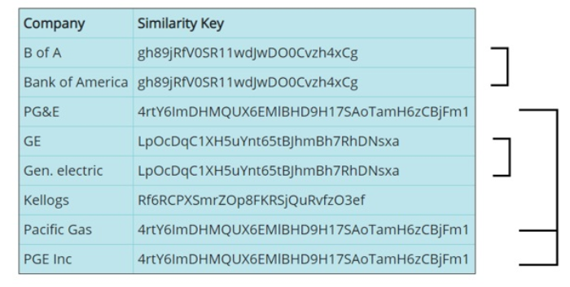

# JavaScript-Examples

These are code examples showing how to call and utilize Interzoid's various Cloud APIs using Go. Interzoid's APIs provide real-time data in several categories for integration into Web sites, applications, and business processes. There are also data matching and data validation APIs that can significantly improve the value of your data assets.

**GetCompanyMatchSimkey.js** - generates a similarity key to use to match/locate other similar company names ("IBM" & "International Business Machines", etc.) - visit the API Page: https://www.interzoid.com/services/getcompanymatchadvanced  

To register for your free **API Key** (a block of free API credits), visit here: https://www.interzoid.com/register  
  
  
These APIs can also be called in batch mode retrieving input data and writing results from/to databases such as Postgres, MySQL, MariaDB, Snowflake, AWS Aurora, SQL Server, Access, .CSV files, etc. (native/odbc & local or Cloud). For more info visit here: https://www.interzoid.com/connect

contact support@interzoid.com with any questions or feedback  

Website: www.interzoid.com  

Twitter: @Interzoid
